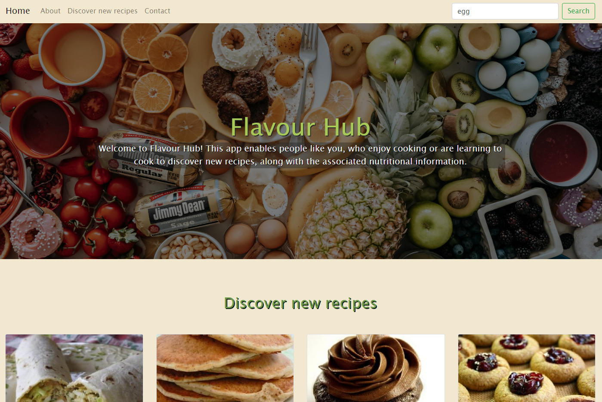

# Flavour-Hub
Flavour-Hub enables people who like to cook or are learning to cook to easily discover new recipes, along with the associated nutritional information.

## Description

This project fullfils the criteria of building a browser application that enables users to discover new recipes, along with specific ingredients nutritional information where desired. It features a clean and responsive user interface and utilises HTML, CSS, Bootstrap and JavaScript.

Flavour-Hub makes use of two APIs: Spoonacular (https://spoonacular.com/food-api) which provides recipe information and Edamam (https://developer.edamam.com/food-database-api) which provides detailed ingredients nutritional information.

## Usage

Access the deployed application at the following URL: https://kbearne.github.io/Flavour-Hub

Flavour-Hub runs in the browser and allows users to search for recipes via the search bar, which then dynamically populates the 'Discover new recipes' section of of the app with the associated API call results.

When browsing recipe results, a user can click on the button to 'View recipe details' which then loads a page which contains detailed recipe information (which encompasses an in depth recipe description, ingredients list, and cooking instructions). Ingredients can be clicked which then loads further nutritional information dynamically to the page (including calories, diet labels and item weight).

App search history persists when the browser is refreshed through the utilisation local storage. Previous search results can be clicked which then calls the associated recipe results from the Spoonacular API.

Flavour-Hub has an aesthetically pleasing and accessible user interface which utilises Bootstrap as well as taking into account accessibility concerns such as utilising an accessible colour scheme, semantic HTML, alt attributes and ARIA labels.

## Built with

   

## Contributors

dami-ani: https://github.com/dami-ani

idareis: https://github.com/idareis

kbearne: https://github.com/kbearne

Temiakindele: https://github.com/Temiakindele

## Credits

Spoonacular API: https://spoonacular.com/food-api

Edamam API: https://developer.edamam.com/food-database-api

Starter code: https://kbearne.github.io/Bootstrap-Portfolio

## License

MIT license